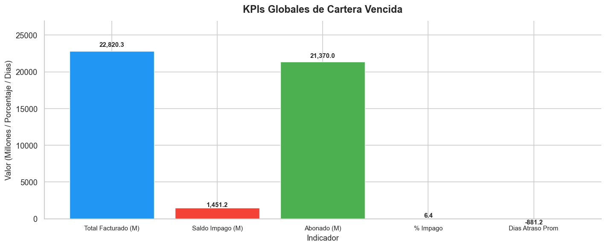
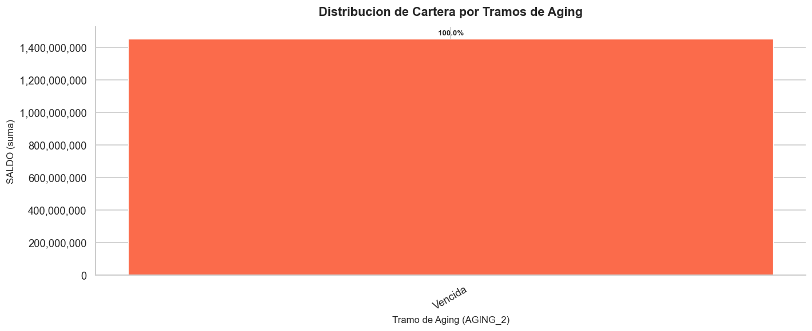
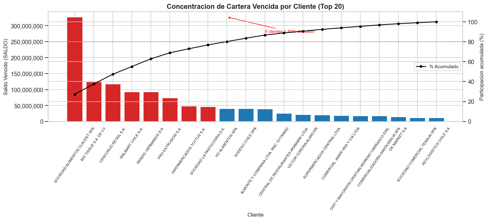
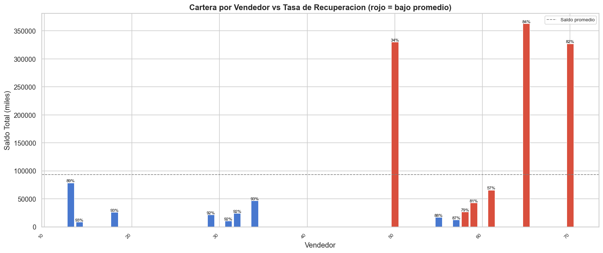
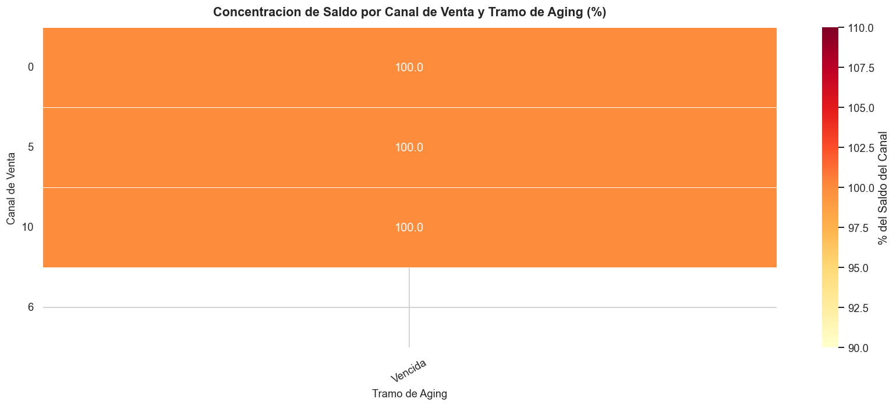
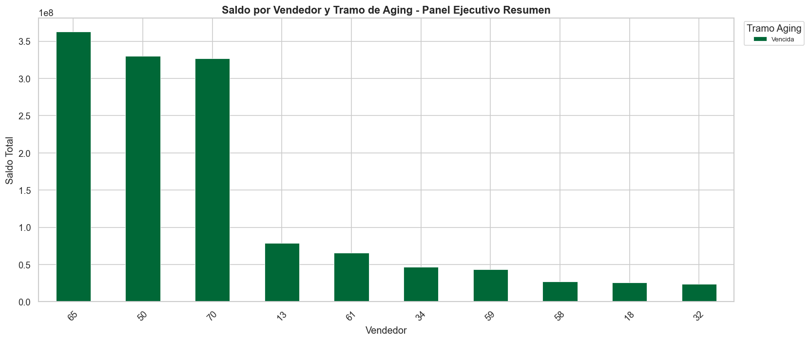

# Análisis de Cartera Vencida y Aging de Clientes

   

Análisis integral de cartera de crédito orientado a identificar concentración de riesgo, segmentar deuda por antigüedad y priorizar acciones de recuperación.
El objetivo es convertir 25,134 transacciones en decisiones ejecutivas concretas sobre cobranza, política de crédito y gestión comercial.

---

## Contexto de Negocio

La empresa analizada opera un modelo comercial con fuerza de ventas estructurada por vendedores y canales, extendiendo crédito a clientes mediante facturas con fechas de vencimiento y seguimiento de saldos pendientes. El ciclo de crédito presenta atrasos significativos que superan los 880 días promedio de antigüedad, lo que indica un problema estructural de recuperación y no una anomalía operativa puntual. Con hasta 10 canales de venta activos y múltiples vendedores gestionando carteras de distintos tamaños, la exposición al riesgo no está distribuida de manera uniforme. Este análisis provee al equipo directivo una visión consolidada que permite focalizar los recursos de cobranza donde el impacto financiero es mayor.

---

## Preguntas que Responde este Análisis

1. ¿Cuáles son los clientes con mayor saldo vencido y qué proporción representan del total de la cartera pendiente?
2. ¿Cómo se distribuye la cartera vencida por tramos de aging y cuál es el monto en riesgo de incobrabilidad por cada segmento?
3. ¿Qué vendedores concentran la mayor cartera vencida y cuál es su tasa de recuperación frente al total facturado?
4. ¿Cuál es la evolución de los días de atraso por canal de venta y qué canal presenta mayor riesgo de cartera irrecuperable?

---

## Estructura del Análisis

| # | Sección | Técnica Aplicada | Insight Clave |
|---|---------|-----------------|---------------|
| 1 | Contexto de Negocio y Visión General de la Cartera | KPIs agregados, estadística descriptiva | El 6.4% del total facturado permanece impago con más de 880 días de antigüedad promedio |
| 2 | Distribución de Cartera por Tramos de Aging | Segmentación por rangos de días, gráfico de barras apiladas | La mayor concentración de saldo vencido se ubica en los tramos de mayor antigüedad, elevando el riesgo de castigo contable |
| 3 | Concentración de Cartera Vencida por Cliente | Análisis de Pareto, ranking de clientes | Menos del 20% de los clientes concentra la mayoría del saldo vencido, permitiendo una lista corta de gestión prioritaria |
| 4 | Rendimiento de Vendedores: Cartera Generada vs Tasa de Recuperación | Comparativo de doble eje, scatter plot | Vendedores con alto volumen presentan tasas de recuperación por debajo del promedio, evidenciando políticas de crédito no homogéneas |
| 5 | Riesgo de Cartera por Canal de Venta | Heatmap canal vs tramo de aging | Determinados canales generan cartera sistemáticamente en los tramos de mayor vencimiento, asociando el riesgo a la estructura de distribución |
| 6 | Conclusiones Ejecutivas y Recomendaciones de Negocio | Panel resumen multidimensional | El cruce cliente-vendedor-canal permite estimar el impacto potencial de recuperar los segmentos de mayor riesgo identificados |

---

## Stack Técnico

| Herramienta | Uso en este Proyecto |
|-------------|----------------------|
| Python 3.x | Lenguaje base para todo el procesamiento y análisis |
| pandas | Limpieza, transformación, segmentación y agrupación de las 25,134 transacciones |
| matplotlib | Construcción de gráficos base: barras, líneas y paneles de KPIs |
| seaborn | Heatmaps de riesgo por canal y visualizaciones de distribución de aging |
| Jupyter Notebook | Entorno de análisis reproducible con narrativa integrada por sección |

---

## Cómo Ejecutar

1. Clonar el repositorio:
   ```bash
   git clone https://github.com/usuario/cartera-vencida-aging.git
   cd cartera-vencida-aging
   ```

2. Crear y activar un entorno virtual (recomendado):
   ```bash
   python -m venv venv
   source venv/bin/activate        # Linux / macOS
   venv\Scripts\activate           # Windows
   ```

3. Instalar las dependencias:
   ```bash
   pip install -r requirements.txt
   ```

4. Lanzar el notebook:
   ```bash
   jupyter notebook notebooks/analisis_cartera_vencida.ipynb
   ```

> Los datos utilizados están anonimizados. El archivo fuente debe ubicarse en `data/raw/` con el nombre especificado en la celda de carga del notebook.

---

## Estructura del Repositorio

```
cartera-vencida-aging/
│
├── data/
│   ├── raw/                          # Datos originales anonimizados (no versionados)
│   └── processed/                    # Datos transformados listos para análisis
│
├── notebooks/
│   └── analisis_cartera_vencida.ipynb  # Notebook principal con las 6 secciones de análisis
│
├── img/
│   ├── grafico_1.png                 # Panel de KPIs generales de cartera
│   ├── grafico_2.png                 # Distribución de saldo por tramos de aging
│   ├── grafico_3.png                 # Concentración de cartera vencida por cliente (Pareto)
│   ├── grafico_4.png                 # Cartera generada vs tasa de recuperación por vendedor
│   ├── grafico_5.png                 # Heatmap de riesgo por canal de venta y tramo de aging
│   └── grafico_6.png                 # Panel ejecutivo resumen multidimensional
│
├── requirements.txt                  # Dependencias del proyecto
├── .gitignore                        # Exclusiones de datos sensibles y entornos
└── README.md                         # Documentación del proyecto
```

---

## Visualizaciones

### Sección 1 — Visión General de la Cartera



El panel de KPIs revela que el 6.4% del total facturado permanece impago con una antigüedad promedio crítica superior a 880 días, confirmando que el problema es estructural y requiere intervención en política de crédito, no solo en operaciones de cobranza.

---

### Sección 2 — Distribución por Tramos de Aging



La distribución por tramos muestra que la mayor parte del saldo vencido se acumula en los rangos de mayor antigüedad, indicando que la cartera deteriorada no ha sido gestionada oportunamente y el riesgo de castigo contable es elevado.

---

### Sección 3 — Concentración de Cartera por Cliente



El análisis de Pareto confirma que un grupo reducido de clientes concentra la mayoría del saldo vencido, lo que permite construir una lista corta de cuentas críticas y maximizar el impacto de los esfuerzos de recuperación.

---

### Sección 4 — Rendimiento de Vendedores



El comparativo por vendedor expone que quienes generan mayor volumen de cartera no necesariamente presentan las mejores tasas de recuperación, evidenciando que las políticas de seguimiento post-venta y otorgamiento de crédito no son homogéneas en el equipo comercial.

---

### Sección 5 — Riesgo por Canal de Venta



El heatmap canal versus tramo de aging revela que determinados canales generan cartera de forma sistemática en los segmentos de mayor vencimiento, demostrando que el riesgo está estructuralmente asociado al canal de distribución y no responde a factores aleatorios.

---

### Sección 6 — Panel Ejecutivo Resumen



El panel de cierre cruza las dimensiones cliente, vendedor y canal en una vista unificada, permitiendo al equipo directivo estimar el impacto potencial de recuperar los segmentos de mayor riesgo y priorizar acciones con criterio financiero.

---

## Hallazgos Clave

- **Concentración crítica de cartera:** Un subconjunto minoritario de clientes acumula la mayor parte del saldo vencido total, lo que convierte la gestión selectiva de cobranza en la palanca de mayor impacto financiero inmediato.
- **Aging avanzado como señal estructural:** La antigüedad promedio superior a 880 días indica que el deterioro de la cartera no es reciente; las facturas en los tramos más altos de aging presentan riesgo real de incobrabilidad y posible necesidad de provisión o castigo contable.
- **Heterogeneidad en el equipo de ventas:** Existen vendedores con carteras de alto volumen y tasas de recuperación significativamente por debajo del promedio del equipo, lo que sugiere la necesidad de revisar los criterios de otorgamiento de crédito y los incentivos comerciales asociados a la recuperación.
- **Riesgo diferenciado por canal de distribución:** Algunos canales de venta concentran sistemáticamente saldos en los tramos de mayor vencimiento, lo que indica que el perfil de riesgo crediticio está parcialmente determinado por la estructura del canal y debe ser considerado en la política de crédito por segmento.

---

*Desarrollado con Python 3.x, pandas, matplotlib, seaborn y Jupyter Notebook. Datos anonimizados. Solo para fines de análisis y demostración.*